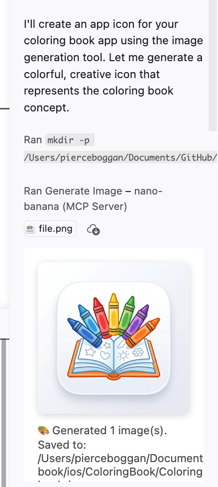

# nano-banana-mcp

An MCP (Model Context Protocol) server for AI image generation using Google Gemini. Generate images from text prompts and optionally provide reference images to inform the output. Supports **MCP Apps** — generated images render as an interactive viewer directly inside the chat in VS Code Copilot, Claude, and other MCP Apps-capable clients.



## Features

- 🎨 **Text-to-image generation** via Google Gemini
- 🖼️ **Image editing** — pass reference images to restyle, edit, or combine
- ✨ **MCP Apps support** — images render as an interactive viewer inline in the conversation (VS Code Copilot, Claude Desktop, Goose, and more)
- 💾 **Save to disk** — optionally save outputs to a directory

## Quick start

```bash
npm install
npm run build
```

Get a free API key at [Google AI Studio](https://aistudio.google.com/apikey).

## Tool: `generate_image`

A single, flexible tool that handles all image generation — from scratch or informed by reference images.

| Parameter | Required | Description |
|-----------|----------|-------------|
| `prompt` | ✅ | Text prompt describing what to generate or how to transform the input |
| `images` | | Optional array of reference images (file paths, data URLs, or base64 strings) |
| `google_api_key` | | Google AI Studio API key (falls back to `GOOGLE_API_KEY` env var) |
| `output_dir` | | Directory to save images to disk |
| `output_name` | | Filename prefix (default: `generated`) |

### Examples

- **From scratch:** `"A minimalist app icon for a weather app, flat design, blue gradient"`
- **Edit an image:** `"Change the background to a sunset"` + `images: ["./photo.jpg"]`
- **Combine references:** `"Merge these two logo concepts into one"` + `images: ["./logo1.png", "./logo2.png"]`

## VS Code configuration

Add to your `mcp.json` (User or workspace):

```json
{
  "servers": {
    "nano-banana": {
      "type": "stdio",
      "command": "node",
      "args": ["<path-to-this-repo>/dist/index.js"],
      "env": {
        "GOOGLE_API_KEY": "${input:google-api-key}"
      }
    }
  },
  "inputs": [
    {
      "id": "google-api-key",
      "type": "promptString",
      "description": "Google AI Studio key",
      "password": true
    }
  ]
}
```

## Claude Desktop configuration

Add to `claude_desktop_config.json`:

```json
{
  "mcpServers": {
    "nano-banana": {
      "command": "node",
      "args": ["<path-to-this-repo>/dist/index.js"],
      "env": {
        "GOOGLE_API_KEY": "your-google-api-key"
      }
    }
  }
}
```

## Development

```bash
npm run dev    # Run with tsx (no build step)
npm run build  # Compile TypeScript
npm start      # Run compiled output
```
